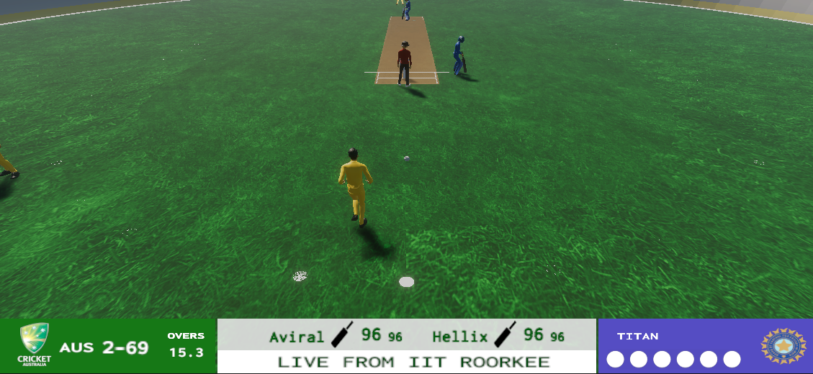
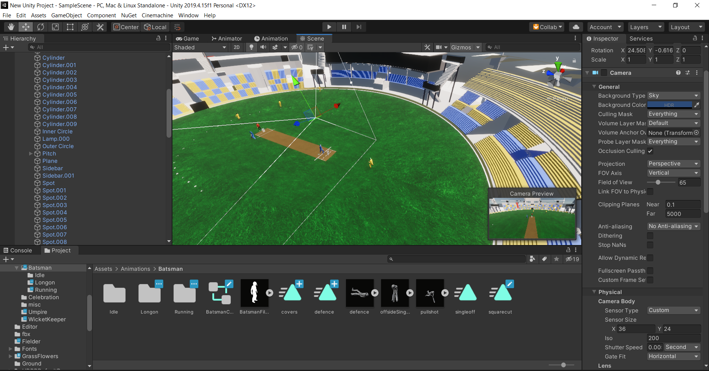
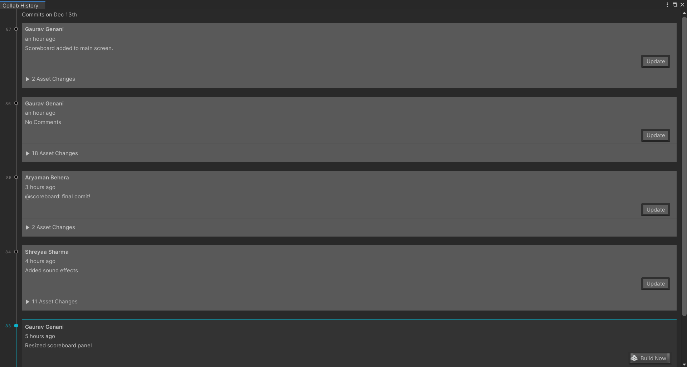
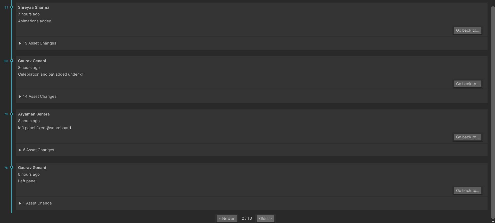
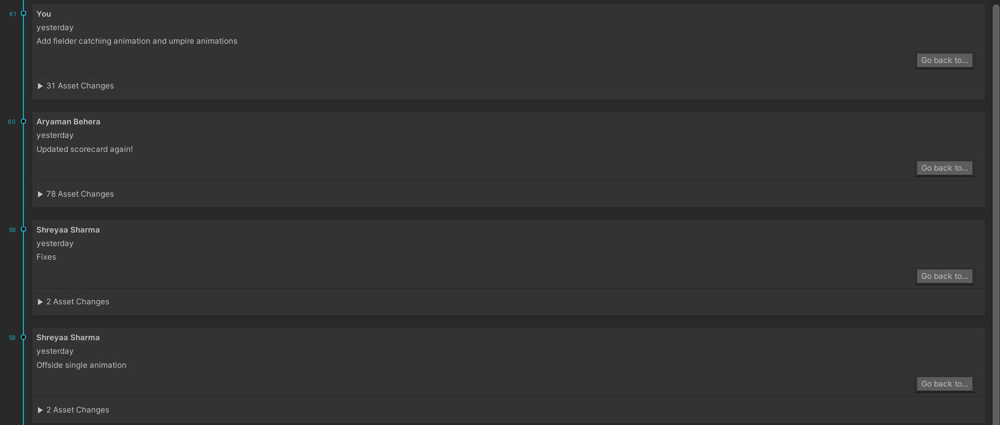

# CricLive
Anytime Anywhere

Tired of shelling out cash for your favourite game? Or reading the mundane commentary? *CricLive* is based on a revolutionary mechanism to recreate a cricket match from text commentary.
Our app grabs live text-commentary from its servers and use it alone to generate a live match on your device using *AI* along with features such as *audio commentary*, *scintillating animations*, and *dynamic ground sounds* all rendered offline without any data usage.
Driven by AI, CricLive animates most actions in cricket matches fairly accurately. What’s more? CricLive, with dual modes 3D and VR, lets you experience cricket like never before. The VR mode makes it possible to roam on-field freely and watch the match from multiple perspectives.
CricLive needs as low internet as it takes to send a WhatsApp message. With offline animations, it ensures smooth streaming even at slow internet speeds or with unstable connections. CricLive, developed on Unity3D game engine, is compatible across all major platforms including Windows, Android, iOS.

## Features:
1. Text-to-Action Technology
2. Live Matches
3. Minimal Internet Usage
4. Dynamic AI
5. Two Modes: VR & 3D
6. Cross-Platform

## Challenges we ran into
1. There were no free assets available- models and animations, thus we had to develop them from scratch using a blender, which was very time-consuming.
2. Implementing algorithms for the movement of fielders to generate the required results.
3. Timing animations for wicketkeeper and other game components.
4. Deploying microservices of WebSocket server and the native implementation of WebSocket client in Unity(C# script) using socket programming principles proved to be quite challenging.
5. UI supporting different screen resolutions. (canvas, scoreboard).

Here is the link to the zip file of the Project Directory:
https://drive.google.com/file/d/1uCOwQED9-d2lzdgSrI_OTcMsqczk-Sm7/view

This Project was developed on Unity Game Engine using Unity Collaborate:

